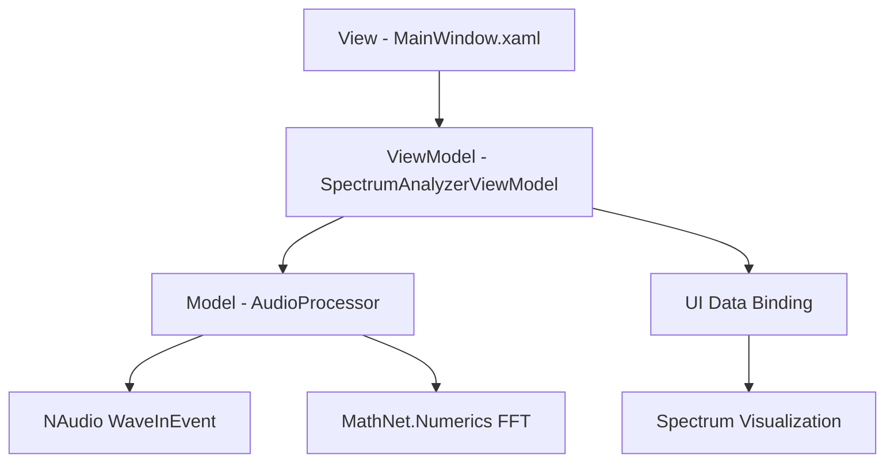
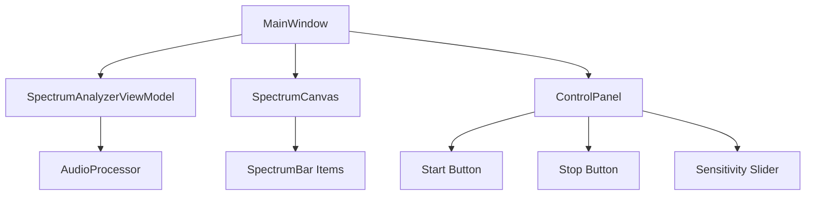
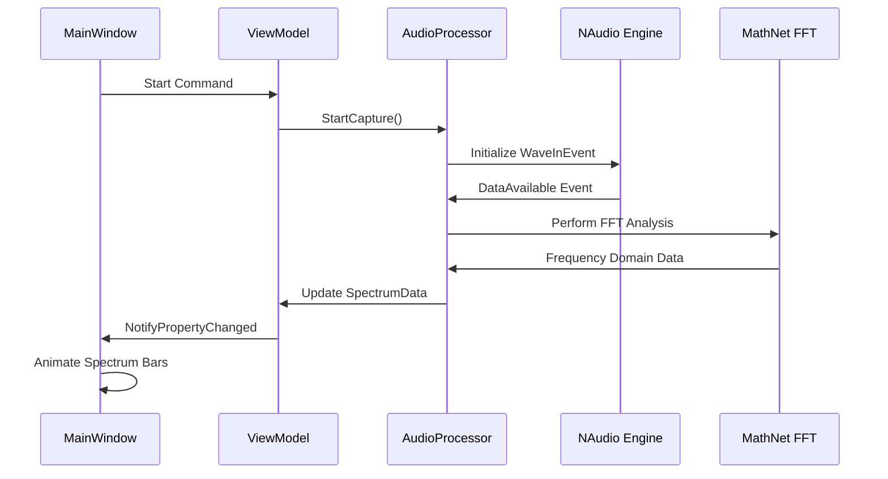
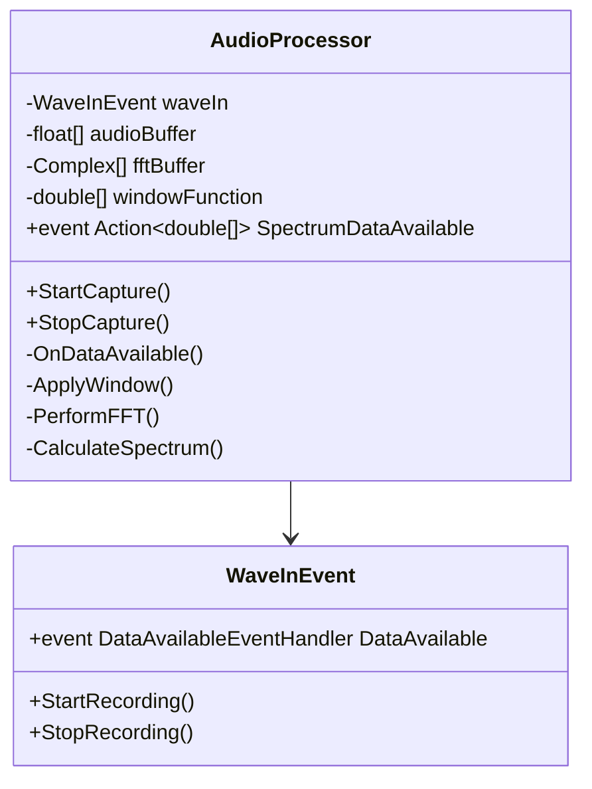
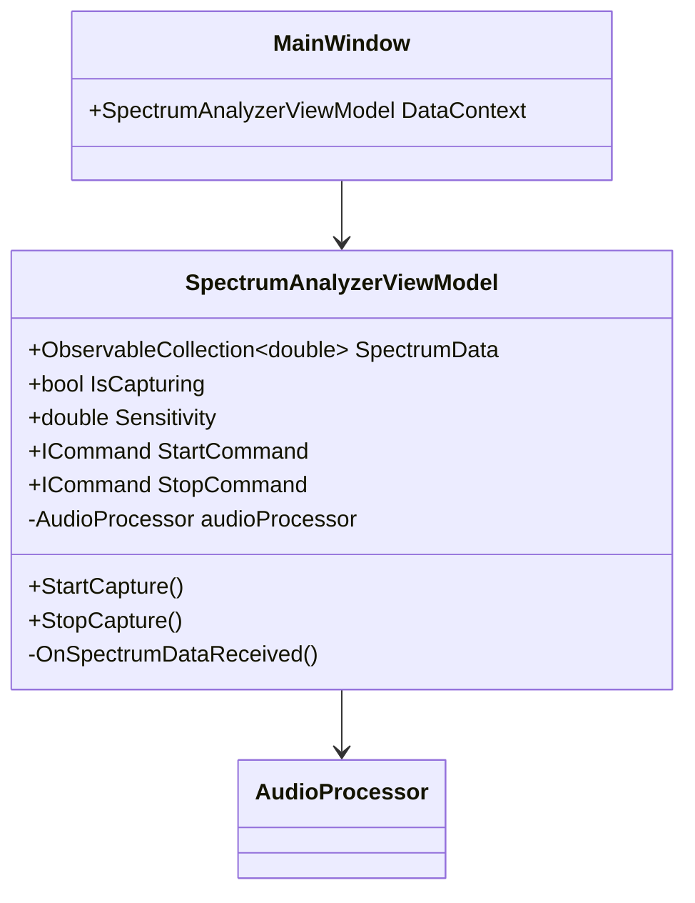
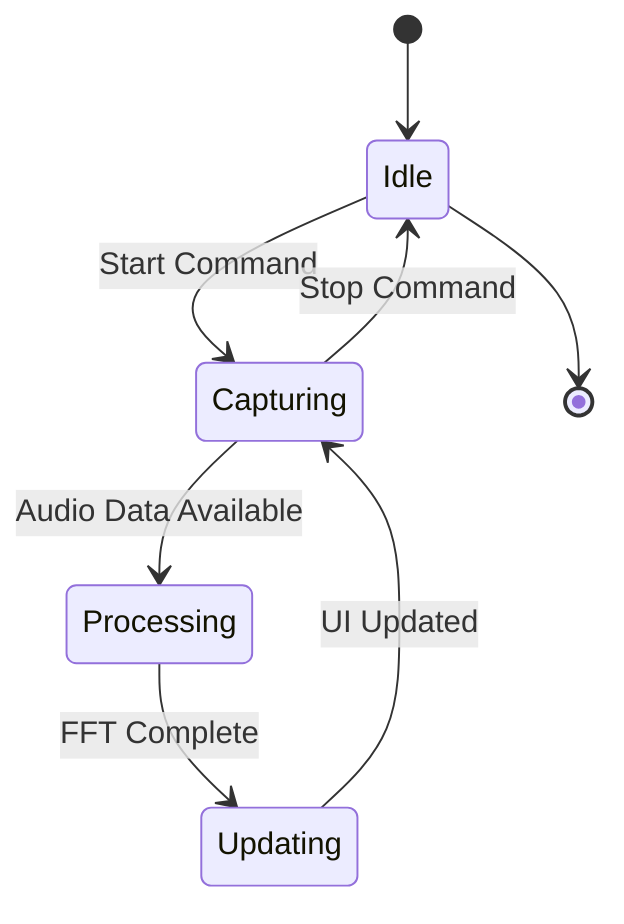
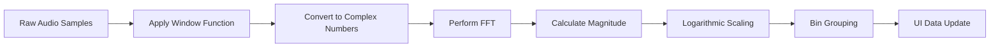
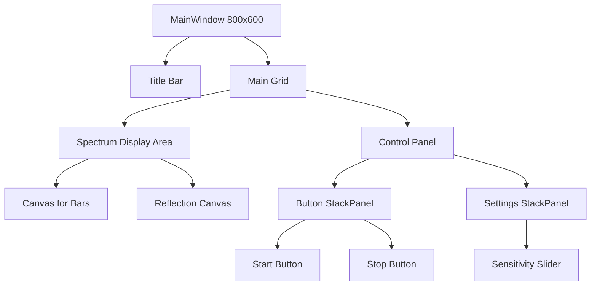

# Audio Spectrum Analyzer Design Document

## Overview

The Audio Spectrum Analyzer is a real-time audio visualization application built with .NET 9 and WPF. The application captures audio input from the default microphone device, performs Fast Fourier Transform (FFT) analysis, and displays the frequency spectrum as animated vertical bars with a mirror reflection effect.

**Target Platform**: .NET 9  
**UI Framework**: WPF  
**Programming Language**: C#  
**Architecture Pattern**: MVVM  

## Technology Stack & Dependencies

### Core Libraries
- **NAudio** - Primary audio processing library for audio capture and manipulation
- **MathNet.Numerics** - Mathematical operations library, specifically for FFT calculations
- **WPF** - Windows Presentation Foundation for UI framework

### Development Dependencies
- .NET 9 SDK
- Visual Studio 2022 or compatible IDE

## Architecture

### MVVM Architecture Overview



### Component Architecture

#### Component Definition

**AudioProcessor (Model)**
- Responsible for audio capture using NAudio
- Handles real-time audio data processing
- Performs FFT analysis using MathNet.Numerics
- Applies windowing functions (Hann/Hamming)

**SpectrumAnalyzerViewModel**
- Manages application state and UI data
- Contains ObservableCollection for spectrum bar heights
- Handles start/stop commands
- Coordinates between audio processing and UI updates

**MainWindow (View)**
- Primary UI containing spectrum visualization
- Control buttons (Start/Stop)
- Optional sensitivity/scale controls

#### Component Hierarchy



#### Props/State Management

**SpectrumAnalyzerViewModel Properties:**
- `ObservableCollection<double> SpectrumData` - Bar heights data
- `bool IsCapturing` - Audio capture state
- `double Sensitivity` - Amplitude sensitivity setting
- `ICommand StartCommand` - Start audio capture
- `ICommand StopCommand` - Stop audio capture

**AudioProcessor Configuration:**
- Sample Rate: 44,100 Hz
- Buffer Size: 1024 samples
- Channels: Mono
- Bit Depth: 16-bit

### Data Flow Architecture



## Component Architecture Details

### AudioProcessor Implementation



### ViewModel Data Binding



## Styling Strategy

### Color Palette
- **Background**: Dark gray (#1E1E1E) or black (#000000)
- **Spectrum Bars**: Orange gradient (#FF8C00 to #FFD700)
- **Reflection**: Semi-transparent orange with vertical gradient
- **Controls**: Light gray (#CCCCCC) text with dark backgrounds

### Visual Effects
- **Gradient Brushes**: For spectrum bar coloring
- **Reflection Transform**: ScaleTransform with Y-axis flip
- **Smooth Animations**: DoubleAnimation for bar height transitions
- **Opacity Masks**: For reflection fade effect

## State Management

### Application State Flow



### Data Binding Strategy
- **OneWay Binding**: Spectrum data from ViewModel to View
- **TwoWay Binding**: Sensitivity slider value
- **Command Binding**: Start/Stop button actions
- **Property Change Notifications**: INotifyPropertyChanged implementation

## API Integration Layer

### Audio Device Integration

**WaveInEvent Configuration:**
```
- DeviceNumber: -1 (default device)
- WaveFormat: 44100 Hz, 16-bit, Mono
- BufferMilliseconds: 23ms (1024 samples)
- NumberOfBuffers: 3
```

**FFT Configuration:**
```
- Window Function: Hann Window
- FFT Size: 1024 points
- Frequency Resolution: 43.066 Hz per bin
- Frequency Range: 0 - 22,050 Hz
- Display Bars: 64 or 128 (configurable)
```

### Real-time Data Processing Pipeline



## Testing Strategy

### Unit Testing Components

**AudioProcessor Tests:**
- Audio device initialization
- FFT calculation accuracy
- Window function application
- Data format conversion

**ViewModel Tests:**
- Command execution
- Property change notifications
- Data collection updates
- State management

**UI Tests:**
- Data binding validation
- Animation performance
- Visual element rendering
- User interaction handling

### Performance Testing
- Real-time audio processing latency
- UI rendering frame rate (target: 60 FPS)
- Memory usage monitoring
- CPU utilization optimization

### Integration Testing
- End-to-end audio capture to visualization
- Multiple audio device compatibility
- Long-running stability tests

## UI Architecture & Navigation

### Visual Layout Structure



### Spectrum Visualization Details

**Bar Rendering:**
- ItemsControl with horizontal StackPanel
- Rectangle elements with data-bound Height
- Orange gradient fill with glow effect
- Smooth height transitions with animations

**Reflection Effect:**
- Duplicate ItemsControl with ScaleTransform (ScaleY = -1)
- OpacityMask with LinearGradientBrush (top: 0.5, bottom: 0.0)
- Positioned below main spectrum with negative margin

### Responsive Design
- Minimum window size: 600x400
- Spectrum bars auto-scale with window width
- Control panel remains fixed height
- Reflection maintains proportional relationship